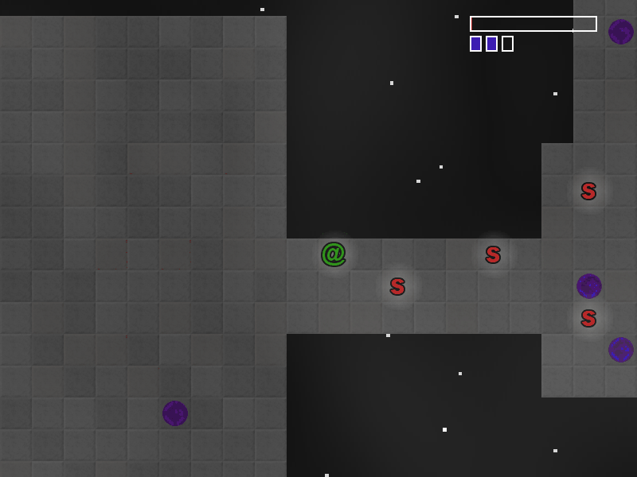

# Mageon

[7DRL](http://7drl.org/) 2016 entry

Official start time, 10:00am MSK, 06 March 2016
Offical end time 03:00am MSK, 13 March 2016
Total time spent 161 hour.
Real time spent about 24 hours.

# Gameplay

Your main objective is to find the right portal from many other.
For every fourth portal you will regain full help.
Use indicators in left upper corner.

# How to play

Use numpad, vi keys or arrow to move or skip turns.
Have fun.

# Requirements

## Rust

You can simply dowload it on official [dowload page](https://www.rust-lang.org/downloads.html).

## *SDL2.0 and SDL2.0_image development libraries*
### Linux
Install these through your favourite package management tool, or via
http://www.libsdl.org/

Ubuntu example:
> sudo apt-get install libsdl2-dev livsdl-image-2-1.0

Fedora example:
> sudo dnf install SDL2-devel SDL2-image

You might also need a C compiler (`gcc`).

### Mac OS X
#### If you are using homebrew
On OSX, it's a good idea to install these via
[homebrew][homebrew].

> brew install sdl2 sdl2_image

Then add the following to your `~/.bash_profile` if not already present.

> export LIBRARY_PATH="$LIBRARY_PATH:/usr/local/lib"

##### Otherwise if you are using macports
You can also get sdl2 via `macports`.

> sudo port install libsdl2 libsdl2_image

Then add the following to your `~/.bash_profile` if not already present.

> export LIBRARY_PATH="$LIBRARY_PATH:/opt/local/lib/"

If you're having issues with either homebrew or macports, [see here][pdev-issue].

### Windows (MinGW)
On Windows, make certain you are using the MinGW version of SDL; the native
version will crash on `sdl2::init`.

1. Download mingw development libraries from
http://www.libsdl.org/ (SDL2-devel-2.0.x-mingw.tar.gz).
2. Unpack to a folder of your choosing (You can delete it afterwards).
3. Copy all lib files from
    > SDL2-devel-2.0.x-mingw\SDL2-2.0.x\x86_64-w64-mingw32\lib

    inside
    > C:\Rust\bin\rustlib\x86_64-pc-windows-gnu\lib

    For Multirust Users, this folder will be in
    > C:\Users\{Your Username}\AppData\Local\.multirust\toolchains\{current toolchain}\lib\rustlib\x86_64-pc-windows-gnu\lib

4. Copy SDL2.dll from
    > SDL2-devel-2.0.x-mingw\SDL2-2.0.x\x86_64-w64-mingw32\bin

    into your cargo project, right next to your Cargo.toml.

# Building

Just clone this repo.

> git clone https://github.com/Vinatorul/Mageon.git && cd Mageon

And then build it with cargo.

> cargo build --release

The binary will be located at "target/release" folder.

## License
`Mageon` is licensed under the MIT license. Please read the LICENSE file in this repository for more information.
